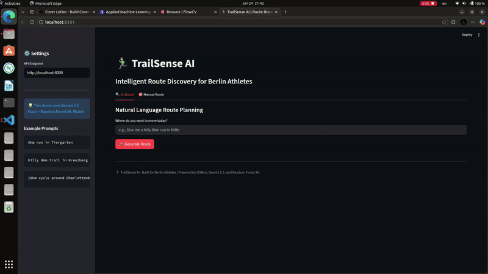

# 🏃‍♂️TrailSense AI
### *Applied ML Routing Engine for Personalized Athlete Experiences*

TrailSense AI is a high-performance routing service that translates natural language athlete intent into ML-optimized geospatial paths. Built as a proof-of-concept, it demonstrates how to bridge the gap between LLM-based intent extraction and deterministic graph theory.



---

## 🛠️ Key Technical Features

### 1. **Intent-to-Movement Parser (Gen AI)**
* **Engine:** Gemini 2.5 Flash Lite.
* **Function:** Translates unstructured prompts (e.g., *"Find me a hilly 8k trail run near Mitte"*) into structured JSON instructions.
* **Resiliency:** Features a **Pydantic validation layer** and a **Heuristic Fallback** system. If the LLM service is unavailable, the system gracefully degrades to a regex-based parser to ensure the athlete always receives a route.

### 2. **Suitability Scoring (Applied ML)**
* **Model:** `RandomForestRegressor` trained on simulated athlete preferences (Incline, Surface Type, Greenery).
* **Vectorized Inference:** Instead of iterative edge processing, the engine utilizes **batch inference** on GeoPandas DataFrames. This reduces cold-start enrichment time by ~85%, critical for scaling to dense urban graphs like Berlin (400k+ nodes).
* **Custom Cost Function:** $$\text{Edge Weight} = \text{Length} \times \left( \frac{1}{\text{ML Popularity Score} + 0.1} \right)$$
* Fixed model to address initial $R^2$ score (-0.6111) 

### 3. **Geospatial Engineering**
* **CRS Alignment:** Implemented a Coordinate Reference System (CRS) transformer using `pyproj` to align WGS84 API inputs with UTM-projected graph math.
* **Topological Robustness:** Automatically identifies and subgraphs the **Largest Connected Component** to prevent routing into "dead-end" isolated nodes.
* **Distance Accuracy:** Uses `geopy.geodesic` math to ensure the distance reported to the athlete matches professional GPS standards.

Osmnx creates a DiGraph so i converted the data structure to exctract the length


---

## 📂 Repository Structure

* `main.py`: The FastAPI core handling graph lifespan, ML weights, and Dijkstra-based routing.
* `trailsense_model.pkl`: Serialized Random Forest artifact for zero-latency startup.
* `demo.py`: A Streamlit-based interactive dashboard for real-time route visualization.
* `requirements.txt`: Comprehensive list of dependencies (OSMnx, NetworkX, Scikit-Learn, etc.).

---

## 🚀 Getting Started

### 1. Environment Setup
```bash

python -m venv .venv
source .venv/bin/activate
pip install -r requirements.txt
export OPENAI_API_KEY="..."
# This will train the model, load the Berlin graph, and enrich edges
uvicorn main:app --reload --host 0.0.0.0 --port 8000
streamlit run demo.py
